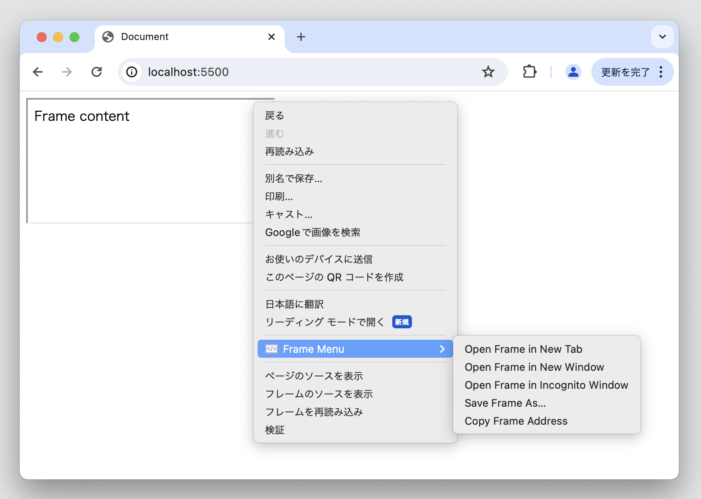

# Frame Menus

Chrome Extension to add utilities for frames to the context menu



## Features

- Context menus
  - Open Frame in New Tab
  - Open Frame in New Window
  - Open Frame in Incognito Window
  - Save Frame As...
  - Copy Frame Address

## How to use

After installing this extension, when you open the context menu for `iframe` or `frame` element, the menus are added.

## Build

```shell
npm install
npm run build
```
